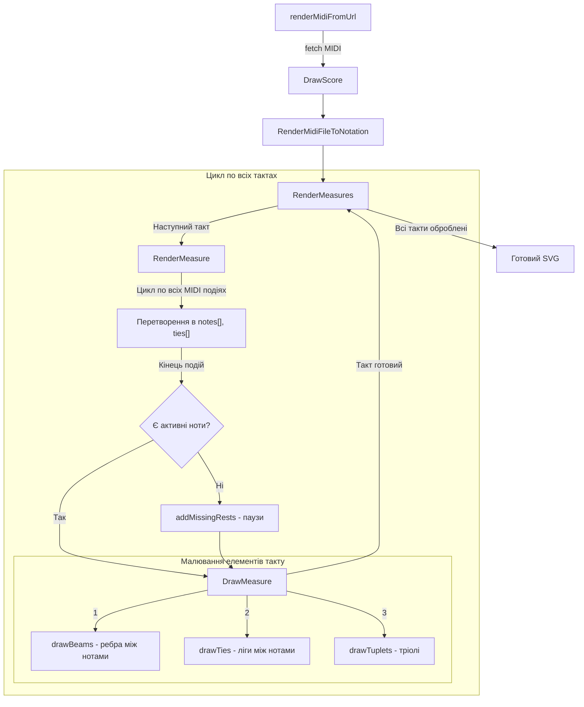

```mermaid
graph TD
    Z[renderMidiFromUrl] -->|"fetch MIDI"| A
    A[DrawScore] --> B[RenderMidiFileToNotation]
    B --> C[RenderMeasures]
    
    subgraph "Цикл по всіх тактах"
        C -->|"Наступний такт"| D[RenderMeasure]
        D -->|"Цикл по всіх MIDI подіях"| E["Перетворення в notes[], ties[]"]
        E -->|"Кінець подій"| F{"Є активні ноти?"}
        F -->|"Ні"| G[addMissingRests - паузи]
        F -->|"Так"| H[DrawMeasure]
        G --> H
        
        subgraph "Малювання елементів такту"
            H -->|"1"| I[drawBeams - ребра між нотами]
            H -->|"2"| J[drawTies - ліги між нотами]
            H -->|"3"| K[drawTuplets - тріолі]
        end
        
        H -->|"Такт готовий"| C
    end
    
    C -->|"Всі такти оброблені"| L[Готовий SVG]
```